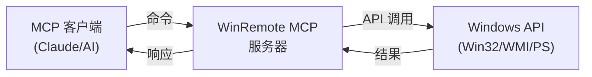

# WinRemote MCP — 在 Windows 上远程运行 MCP 服务器

[English README](README.md) | [中文说明](README.zh-CN.md)

[](https://pypi.org/project/winremote-mcp/)
[](https://pypi.org/project/winremote-mcp/)
[](https://opensource.org/licenses/MIT)
[](https://github.com/dddabtc/winremote-mcp/actions/workflows/ci.yml)
[](https://pepy.tech/projects/winremote-mcp)
[](https://glama.ai/mcp/servers/dddabtc/win-remote-mcp)

**面向远程桌面控制与自动化的终极 Windows MCP 服务器。** 通过 Model Context Protocol 控制任何 Windows 机器——非常适合 AI 代理、Claude Desktop。将您的 Windows 桌面转换为一个强大的、可远程访问的自动化端点。

在**需要控制的 Windows 机器**上运行。基于 [FastMCP](https://github.com/jlowin/fastmcp) 和 [Model Context Protocol](https://modelcontextprotocol.io/) 构建。

## 快速上手（30 秒）

```bash
# 从 PyPI 安装
pip install winremote-mcp

# 启动 Windows MCP 服务器
winremote-mcp
```

完成！您的 Windows MCP 服务器现在运行在 `http://127.0.0.1:8090`，已准备好接收来自 Claude Desktop 等 MCP 客户端的命令。

## 🤖 AI 代理集成

winremote-mcp 可与兼容 MCP 的 AI 代理和客户端配合使用。客户端特定的设置指南位于本仓库：

- [Hermes](skill/hermes/) — 将 winremote 添加为原生流式 HTTP 或 stdio MCP 服务器。
- [OpenClaw](skill/openclaw/) — 将 winremote 用作 OpenClaw 的 Windows 控制层。
- [Claude Desktop / Claude Code](skill/claude/) — 配置本地 stdio 或远程流式 HTTP。
- [Cursor](skill/cursor/) — 添加 winremote 到 `.cursor/mcp.json`。

### Hermes 设置

在 Windows 机器上运行 winremote-mcp，然后将其添加为 Hermes 的 MCP 服务器：

```powershell
pip install winremote-mcp
winremote-mcp --host 0.0.0.0 --port 8090 --auth-key "your-secret-key"
```

```yaml
mcp_servers:
  winremote:
    type: streamable-http
    url: http://<windows-ip>:8090/mcp
    headers:
      Authorization: Bearer ***
```

详情请参阅完整的 [Hermes 集成指南](skill/hermes/)，包含本地 stdio 设置、验证提示和可用功能。

## 🤖 OpenClaw 集成

winremote-mcp 是 [OpenClaw](https://github.com/openclaw/openclaw) 的官方 Windows 控制层。二者结合可让您的 AI 代理完全远程控制任何 Windows 机器——截图、PowerShell、文件传输、GUI 自动化等。

---

### 最简单的方式：直接告诉 OpenClaw

您无需手动配置任何内容。只需告诉您的 OpenClaw 代理：

> "在我的 Windows 机器 `192.168.1.100` 上安装 winremote-mcp 并连接到我自己。Python 安装在 `C:\Python311\python.exe`。"

OpenClaw 会通过 SSH 连接到 Windows 机器，安装软件包，启动服务器，并自动配置 MCP 连接——全程自动化。

---

### 手动设置（分步指南）

#### 第一步 — 在 Windows 上安装

```cmd
pip install winremote-mcp
```

#### 第二步 — 启动服务器

**仅本地快速启动（默认，最安全）：**
```cmd
winremote-mcp
```

**远程访问需要身份验证：**

从 v0.4.20 起，`winremote-mcp` 在没有身份验证的情况下拒绝将 HTTP 传输绑定到非回环地址。如需局域网或远程访问，请使用 API 密钥：

```cmd
winremote-mcp --host 0.0.0.0 --port 8090 --auth-key YOUR_SECRET_KEY
```

对于仅实验室环境的旧行为，可以使用 `--allow-insecure-remote` 显式确认风险；请勿在共享、路由或互联网暴露的网络上使用此选项。

**开机自启动：**
```cmd
winremote-mcp install
```

#### 第三步 — 连接 OpenClaw

添加到您的 `openclaw.json`：

```json
{
  "plugins": {
    "entries": {
      "winremote": {
        "type": "mcp",
        "url": "http://192.168.1.100:8090/mcp",
        "headers": {
          "Authorization": "Bearer YOUR_SECRET_KEY"
        }
      }
    }
  }
}
```

或告诉您的 OpenClaw 代理：
> "在 `http://192.168.1.100:8090/mcp` 添加 winremote MCP，认证密钥为 `YOUR_SECRET_KEY`。"

#### 第四步 — 代理可以做什么

连接后，您的 AI 代理将拥有完整的 Windows 控制能力：

| 功能 | 示例 |
|------|------|
| 🖥️ 截图 | 捕获整个桌面或特定窗口 |
| ⚡ Shell 执行 | 运行 PowerShell、CMD 或批处理脚本 |
| 📁 文件传输 | 在 Linux 和 Windows 之间上传/下载文件 |
| 🖱️ GUI 自动化 | 点击、输入、拖拽——控制任何 Windows 应用 |
| 🔧 系统信息 | 进程列表、服务、事件日志、注册表 |
| 📷 OCR | 从任何屏幕区域提取文本 |
| 🎬 屏幕录制 | 将桌面活动录制为 GIF |

---

### 安全远程访问（HTTPS）

对于通过互联网或不受信任网络的访问，请启用 HTTPS：

**第一步 — 生成证书：**
```bash
# 自签名证书（局域网/家庭实验室）
openssl req -x509 -newkey rsa:4096 -keyout key.pem -out cert.pem -days 365 -nodes

# 受信任证书（无浏览器警告）— 需要安装 mkcert
mkcert -install && mkcert 192.168.1.100
```

**第二步 — 使用 TLS 启动：**
```cmd
winremote-mcp --host 0.0.0.0 --port 8090 ^
  --auth-key YOUR_SECRET_KEY ^
  --ssl-certfile cert.pem ^
  --ssl-keyfile key.pem
```

**带 HTTPS 的 OpenClaw 配置：**
```json
{
  "plugins": {
    "entries": {
      "winremote": {
        "type": "mcp",
        "url": "https://192.168.1.100:8090/mcp",
        "headers": {
          "Authorization": "Bearer YOUR_SECRET_KEY"
        }
      }
    }
  }
}
```

---

### OAuth 2.0（适用于 Claude Desktop 和其他 MCP 客户端）

某些 MCP 客户端（如 Claude Desktop）使用 OAuth 而非 API 密钥。OAuth 是预配置的机密客户端流程：在服务器上配置客户端 ID 和客户端密钥，然后将相同的值复制到客户端。动态客户端注册已禁用，重定向 URI 必须是回环 `http(s)` URI。

```cmd
winremote-mcp --host 0.0.0.0 --port 8090 ^
  --ssl-certfile cert.pem --ssl-keyfile key.pem ^
  --oauth-client-id my-client --oauth-client-secret my-secret
```

**Claude Desktop 配置（`claude_desktop_config.json`）：**
```json
{
  "mcpServers": {
    "winremote": {
      "type": "http",
      "url": "https://192.168.1.100:8090/mcp/",
      "oauth": {
        "clientId": "my-client",
        "clientSecret": "my-secret"
      }
    }
  }
}
```

---

### `winremote.toml` — 完整配置参考

放置在工作目录或 `~/.config/winremote/winremote.toml`：

```toml
[server]
host         = "0.0.0.0"
port         = 8090
auth_key     = "your-secret-key"
# 可选的紧急开关，仅用于受信任的局域网旧部署。
# 除非此值为 true，否则拒绝无认证的远程 HTTP。
allow_insecure_remote = false
ssl_certfile = "C:/certs/cert.pem"   # 可选 — 启用 HTTPS
ssl_keyfile  = "C:/certs/key.pem"    # 可选 — 启用 HTTPS

[security]
ip_allowlist        = ["192.168.1.0/24"]   # 仅限局域网
oauth_client_id     = ""                    # 可选 OAuth 客户端 ID
oauth_client_secret = ""                    # 可选 OAuth 密钥

[tools]
exclude = ["ScreenRecord"]   # 禁用特定工具
```

---

> **注意：** winremote-mcp 是一个标准 MCP 服务器，可与任何 MCP 兼容的客户端配合使用——Claude Desktop、Cursor、OpenClaw 等。

## v0.4.23 新增功能

### 🐛 FastMCP debug/uvicorn 兼容性修复

- 修复 FastMCP 3.2.4+ 中 `run_http_async` 参数从 `uvicorn_args` 改为 `uvicorn_config` 后，`winremote-mcp --debug` 启动时报错的问题。
- 现在会自动检测当前 FastMCP 支持的参数名，并继续把 uvicorn 的 DEBUG 日志配置传递给 HTTP 传输层；旧版 FastMCP 仍保持兼容。
- 已添加回归测试，覆盖新旧 uvicorn 配置参数的兼容路径。

## v0.4.22 新增功能

### 🐛 恢复调试标志

- 添加了文档化的 `--debug` CLI 标志，使 `winremote-mcp --debug` 可以被接受。
- `--debug` 启用 winremote 的 DEBUG 日志记录，并向 uvicorn 传递 `log_level=debug` 用于 HTTP 传输。

### 🔒 依赖安全更新

- 添加了 `idna>=3.15` 和 `starlette>=1.0.1` 的最低约束，以避免已知漏洞版本。

### 📚 README 发布说明整理

- README 现在只保留最近两个"What's New"部分。
- 更早的发布说明可在完整的 [CHANGELOG](CHANGELOG.md) 中查看。

## v0.4.21 新增功能

### 📚 README 发布说明整理

- README 保持最近的"What's New"部分简洁，并将更早的发布说明指向完整的 [CHANGELOG](CHANGELOG.md)。

更早的发布说明请参阅完整的 [CHANGELOG](CHANGELOG.md)。

## 它解决什么问题

- **远程 Windows 控制**：通过标准化的 MCP 协议从任何地方控制 Windows 桌面
- **AI 代理集成**：让 Claude、GPT 和其他 AI 代理与 Windows GUI 应用程序交互
- **跨平台自动化**：弥合 Linux/macOS 开发环境与 Windows 目标之间的差距
- **无头 Windows 管理**：无需 RDP 或 VNC 开销即可管理 Windows 服务器和工作站

## 功能特性

- **桌面控制** — 截图捕获（JPEG 压缩、多显示器）、点击、输入、滚动、键盘快捷键
- **窗口管理** — 聚焦窗口、最小化全部、启动/调整应用程序、多显示器支持
- **远程 Shell 访问** — 带工作目录支持的 PowerShell 命令执行
- **文件操作** — 读取、写入、列出、搜索文件；通过 base64 编码传输二进制文件
- **系统管理** — Windows 注册表访问、服务管理、计划任务、进程控制
- **网络工具** — Ping 主机、检查 TCP 端口、监控网络连接
- **高级功能** — OCR 文本提取、屏幕录制（GIF）、带 UI 元素标注的注释截图
- **AI 视觉支持** — 支持 Flutter、Electron、Qt 和任何 UI。参见 [视觉指南](docs/vision-guide.md)
- **安全与认证** — 可选的 API 密钥认证，默认为仅本地绑定

## 安装

### 从 PyPI 安装（推荐）
```bash
pip install winremote-mcp
```

### 从源码安装
```bash
git clone https://github.com/dddabtc/winremote-mcp.git
cd winremote-mcp
pip install .
```

### 带可选依赖安装
```bash
# 安装带 OCR 支持（包含 pytesseract）
pip install winremote-mcp[ocr]

# 安装开发依赖
pip install winremote-mcp[test]
```

### OCR 设置（可选）
文本提取功能需要：
```bash
# 1. 安装 Tesseract OCR 引擎
winget install UB-Mannheim.TesseractOCR

# 2. 安装带 OCR 依赖
pip install winremote-mcp[ocr]
```

## 使用方法

### 基础用法

### 分层和工具控制
```bash
# 默认：启用 tier1 + tier2，禁用 tier3
winremote-mcp

# 启用破坏性 tier3 工具
winremote-mcp --enable-tier3

# 禁用交互式 tier2（仅 tier1）
winremote-mcp --disable-tier2

# 组合使用：tier1 + tier3（禁用 tier2）
winremote-mcp --enable-tier3 --disable-tier2

# 向后兼容：启用全部
winremote-mcp --enable-all

# 显式工具列表（优先级最高，覆盖分层标志）
winremote-mcp --tools Snapshot,Click,Type

# 从已解析的集合中移除特定工具
winremote-mcp --enable-tier3 --exclude-tools Shell,FileWrite
```

### 配置文件（`winremote.toml`）
搜索顺序：
1. `--config /path/to/winremote.toml`
2. `./winremote.toml`
3. `~/.config/winremote/winremote.toml`

```toml
[server]
host = "127.0.0.1"
port = 8090
auth_key = ""
ssl_certfile = ""       # SSL 证书路径，用于 HTTPS
ssl_keyfile = ""        # SSL 私钥路径，用于 HTTPS

[security]
ip_allowlist = ["127.0.0.1", "192.168.1.0/24"]
enable_tier3 = false
disable_tier2 = false
oauth_client_id = ""    # 预期的 OAuth 客户端 ID（可选）
oauth_client_secret = "" # 机密客户端的 OAuth 密钥

[tools]
enable = ["Snapshot", "Click", "Type"]
exclude = []
```

**优先级：** CLI 标志覆盖配置文件值；配置文件值覆盖默认值。

### IP 白名单
```bash
# CLI
winremote-mcp --ip-allowlist 127.0.0.1,192.168.1.0/24

# 或通过配置 [security].ip_allowlist
```

支持单个 IP 和 CIDR 范围（IPv4/IPv6）。不在白名单中的客户端将收到 HTTP 403 和清晰的错误提示。

### HTTPS / TLS

要启用 HTTPS，请提供 SSL 证书和密钥文件：

```bash
winremote-mcp --ssl-certfile cert.pem --ssl-keyfile key.pem
```

或在 `winremote.toml` 中：
```toml
[server]
ssl_certfile = "/path/to/cert.pem"
ssl_keyfile  = "/path/to/key.pem"
```

**生成自签名证书**（用于本地/局域网）：
```bash
openssl req -x509 -newkey rsa:4096 -keyout key.pem -out cert.pem -days 365 -nodes
```

### OAuth 2.0

WinRemote MCP 包含内置的 OAuth 2.0 授权服务器，兼容 Claude Desktop 和其他需要 OAuth 的 MCP 客户端。

启用方法：
```bash
winremote-mcp --oauth-client-id my-client --oauth-client-secret my-secret
```

或在 `winremote.toml` 中：
```toml
[security]
oauth_client_id     = "my-client"
oauth_client_secret = "my-secret"
```

**Claude Desktop 配置**（`claude_desktop_config.json`）：
```json
{
  "mcpServers": {
    "winremote": {
      "type": "http",
      "url": "https://your-host:8080/mcp/",
      "oauth": {
        "clientId": "my-client",
        "clientSecret": "my-secret"
      }
    }
  }
}
```

OAuth 服务器实现：
- `GET /.well-known/oauth-authorization-server` — 服务器元数据（RFC 8414）
- `POST /oauth/register` — 动态客户端注册（RFC 7591）
- `GET /oauth/authorize` — 授权码 + PKCE（RFC 7636）
- `POST /oauth/token` — 令牌交换

### 健康检查
```bash
# 启动 MCP 服务器（仅本地，无认证）
winremote-mcp

# 启动带远程访问和身份验证
winremote-mcp --host 0.0.0.0 --port 8090 --auth-key "your-secret-key"

# 启用所有工具，包括高风险 Tier 3（Shell、FileWrite 等）
winremote-mcp --enable-all

# 启动带热重载用于开发
winremote-mcp --reload
```

### MCP 客户端配置

**Claude Desktop（`claude_desktop_config.json`）：**
```json
{
  "mcpServers": {
    "winremote": {
      "command": "winremote-mcp",
      "args": ["--transport", "stdio"]
    }
  }
}
```

**HTTP MCP 客户端：**
```json
{
  "mcpServers": {
    "winremote": {
      "type": "streamable-http",
      "url": "http://192.168.1.100:8090/mcp",
      "headers": {
        "Authorization": "Bearer your-secret-key"
      }
    }
  }
}
```

### 开机自启动
```bash
# 创建 Windows 计划任务
winremote-mcp install

# 移除计划任务
winremote-mcp uninstall
```

## 安全性

工具分为三个风险层级。默认情况下，仅启用 Tier 1-2 工具。

| 层级 | 风险 | 默认 | 示例 |
|------|------|------|------|
| **Tier 1** | 只读 | ✅ 启用 | Snapshot、GetSystemInfo、FileList |
| **Tier 2** | 交互式 | ✅ 启用 | Click、Type、Shortcut、Scrape |
| **Tier 3** | 破坏性/服务端影响 | ❌ 禁用 | Shell、App、PlaySound、FileWrite |

```bash
# 启用所有层级（谨慎使用）
winremote-mcp --enable-all

# 远程访问务必使用认证
winremote-mcp --host 0.0.0.0 --auth-key "your-secret-key"
```

请参阅 [SECURITY.md](SECURITY.md) 获取完整安全指南。

## 工具

| 工具 | 描述 |
|------|------|
| **桌面** | |
| Snapshot | 截图（JPEG，可配置质量/max_width）+ 窗口列表 + UI 元素 |
| AnnotatedSnapshot | 带交互元素编号标签的截图 |
| OCR | 通过 OCR 从屏幕提取文本（pytesseract 或 Windows 内置） |
| ScreenRecord | 将屏幕活动录制为动态 GIF |
| PlaySound | 在 Windows 主机上播放音频文件（.wav/.mp3/.ogg/.wma/.m4a，本地路径或 URL） |
| **输入** | |
| Click | 鼠标点击（左/右/中键，单击/双击/悬停） |
| Type | 在坐标位置输入文本 |
| Scroll | 垂直/水平滚动 |
| Move | 移动鼠标 / 拖拽 |
| Shortcut | 键盘快捷键 |
| Wait | 暂停执行 |
| **窗口管理** | |
| FocusWindow | 将窗口置于前台（模糊标题匹配） |
| MinimizeAll | 显示桌面（Win+D） |
| App | 启动/切换/调整应用程序 |
| **系统** | |
| Shell | 执行 PowerShell 命令（可选 cwd） |
| GetClipboard | 读取剪贴板 |
| SetClipboard | 写入剪贴板 |
| ListProcesses | 进程列表（含 CPU/内存） |
| KillProcess | 按 PID 或名称终止进程 |
| GetSystemInfo | 系统信息 |
| Notification | Windows 通知 |
| LockScreen | 锁定工作站 |
| ReconnectSession | 将断开的 Windows 桌面会话重新连接到控制台 |
| **文件系统** | |
| FileRead | 读取文件内容 |
| FileWrite | 写入文件内容 |
| FileList | 列出目录内容 |
| FileSearch | 按模式搜索文件 |
| FileDownload | 下载文件为 base64（二进制） |
| FileUpload | 从 base64 上传文件（二进制） |
| **注册表与服务** | |
| RegRead | 读取 Windows 注册表值 |
| RegWrite | 写入 Windows 注册表值 |
| ServiceList | 列出 Windows 服务 |
| ServiceStart | 启动 Windows 服务 |
| ServiceStop | 停止 Windows 服务 |
| **计划任务** | |
| TaskList | 列出计划任务 |
| TaskCreate | 创建计划任务 |
| TaskDelete | 删除计划任务 |
| **网络** | |
| Scrape | 获取 URL 内容 |
| Ping | Ping 主机 |
| PortCheck | 检查 TCP 端口是否开放 |
| NetConnections | 列出网络连接 |
| EventLog | 读取 Windows 事件日志条目 |

## 工作原理



**传输选项：**
- **stdio**：直接进程通信（适合 Claude Desktop）
- **HTTP**：带可选认证的 RESTful API（适合远程访问）

**核心架构：**
1. **工具层**：40+ Windows 自动化工具（截图、点击、输入等）
2. **任务管理器**：并发控制和任务取消
3. **传输层**：通过 stdio 或 HTTP 的 MCP 协议
4. **安全层**：可选的 Bearer 令牌认证

## 与非标准 UI 框架配合使用

`AnnotatedSnapshot` 使用 Win32 API 检测 UI 元素，对 **Flutter、Electron、Qt** 或自定义绘制的 UI 无效。三种解决方案：

| 方案 | 设置难度 | GPU 需求 | 适用场景 |
|------|----------|----------|----------|
| **Snapshot + Claude Vision** | 无 | 否 | 大多数用户——Claude 查看截图并点击 |
| **[UI-TARS Desktop](https://github.com/bytedance/UI-TARS-desktop)** | 中等 | 16 GB | 最高准确率（94.2%），最佳中文 UI 支持 |
| **[OmniMCP](https://github.com/OpenAdaptAI/OmniMCP)** | 中等 | 16 GB | 多 LLM 设置（LLM 无关） |

**快速示例**——无需额外工具：
```
你：    "用 Snapshot 截图，找到 Connect 按钮，然后点击它。"
Claude： 1. 调用 Snapshot() → 看到 Flutter 应用截图
         2. 视觉识别出 "Connect" 按钮在 (520, 340)
         3. 调用 Click(x=520, y=340)
```

完整的设置说明、架构图和对比基准测试，请参阅 **[docs/vision-guide.md](docs/vision-guide.md)**。

## 故障排除 / 常见问题

### Q: MCP 服务器无法启动？
**A:** 检查 Python 版本（需要 3.10+）并确保没有其他服务占用端口 8090：
```bash
python --version
netstat -an | findstr :8090
```

### Q: 无法从远程机器连接？
**A:** 使用 `--host 0.0.0.0` 绑定到所有接口（默认仅 localhost）：
```bash
winremote-mcp --host 0.0.0.0 --auth-key "secure-key"
```

### Q: 截图工具返回空/黑图？
**A:** Windows 可能被锁定或显示器关闭。请确保：
- Windows 已解锁且显示器处于活动状态
- 没有屏幕保护程序运行
- 对于多显示器设置，请指定 `monitor` 参数

### Q: OCR 不工作？
**A:** 安装 Tesseract OCR 引擎：
```bash
winget install UB-Mannheim.TesseractOCR
pip install winremote-mcp[ocr]
```

### Q: 注册表/服务权限错误？
**A:** 以管理员权限运行：
```bash
# 右键命令提示符 → "以管理员身份运行"
winremote-mcp
```

## 贡献

我们欢迎贡献！详情请参阅我们的 [贡献指南](CONTRIBUTING.md)。

### 开发环境设置
```bash
git clone https://github.com/dddabtc/winremote-mcp.git
cd winremote-mcp
pip install -e ".[test]"
pytest  # 运行测试
```

## 致谢

灵感来源于 CursorTouch 的 [Windows-MCP](https://github.com/CursorTouch/Windows-MCP)。感谢在 Windows 桌面自动化通过 MCP 方面的开创性工作。

## 许可证

本项目采用 MIT 许可证——详见 [LICENSE](LICENSE) 文件。

---

**准备好用 AI 自动化 Windows 了吗？** ⚡ 安装 `winremote-mcp`，在 30 秒内将您最喜爱的 AI 代理连接到任何 Windows 机器。
