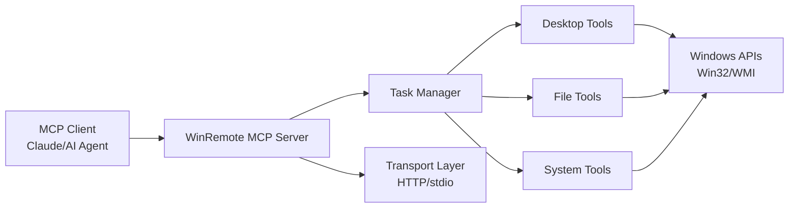

# WinRemote MCP — Windows Remote Control via MCP

**The ultimate Windows MCP server for remote desktop control and automation.**

Control any Windows machine through the Model Context Protocol — perfect for AI agents, Claude Desktop, and OpenClaw integration. Transform your Windows desktop into a powerful, remotely-accessible automation endpoint.

## Quick Start

```bash
# Install from PyPI
pip install winremote-mcp

# Start the Windows MCP server
winremote-mcp
```

Your Windows MCP server is now running on `http://127.0.0.1:8090` and ready to accept commands from MCP clients.

## What is WinRemote MCP?

WinRemote MCP is a Model Context Protocol (MCP) server that enables AI agents and applications to remotely control Windows desktops. It provides 40+ tools for:

- **Desktop Control**: Screenshots, mouse clicks, keyboard input, scrolling
- **Window Management**: Focus, minimize, launch applications
- **System Administration**: Registry, services, processes, scheduled tasks
- **File Operations**: Read, write, list, search files
- **Network Tools**: Ping, port checking, connection monitoring

## Key Features

### 🖥️ Complete Desktop Control
- Multi-monitor screenshot capture with JPEG compression
- Mouse control (click, drag, hover) with pixel-perfect accuracy
- Keyboard input and shortcuts (Ctrl+C, Alt+Tab, etc.)
- Window management and application launching

### 🔒 Security-First Design
- **Localhost-only by default** - secure out of the box
- Optional API key authentication for remote access
- Per-tool permission control (coming soon)
- Bearer token authentication for HTTP transport

### 🚀 High Performance
- **Concurrent task execution** with smart resource management
- **Task cancellation** and status monitoring
- **Hot reload** support for development
- **Streamable HTTP** and **stdio** transports

### 🤖 AI Agent Ready
- Native MCP protocol support
- Ready-to-use configs for Claude Desktop, OpenClaw, Cursor
- Comprehensive error handling and helpful messages
- Structured tool responses perfect for AI parsing

## Architecture



## Use Cases

### AI-Powered Desktop Automation
Enable Claude or other AI agents to:
- Take screenshots and analyze UI elements
- Fill forms and interact with web browsers
- Automate repetitive desktop tasks
- Monitor applications and system status

### Remote System Administration
- Manage Windows servers without RDP overhead
- Schedule and monitor system tasks
- Access registry and system configuration
- Monitor network connections and processes

### Cross-Platform Development
- Control Windows VMs from Linux/macOS environments
- Automate Windows-specific testing scenarios
- Bridge development workflows across platforms

## Getting Started

Ready to get started? Check out our [Installation Guide](installation.md) or jump straight to [Usage Examples](usage.md).

For AI developers, see our pre-built configurations:
- [Claude Desktop Integration](https://github.com/dddabtc/winremote-mcp/tree/master/skill/claude)
- [OpenClaw Integration](https://github.com/dddabtc/winremote-mcp/tree/master/skill/openclaw)
- [Cursor Integration](https://github.com/dddabtc/winremote-mcp/tree/master/skill/cursor)